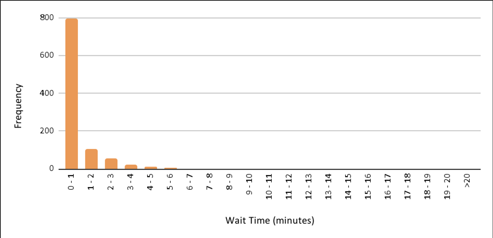
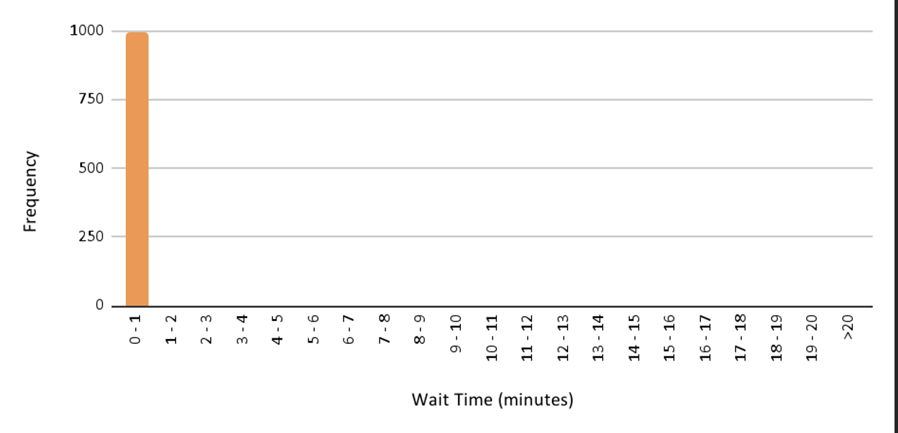
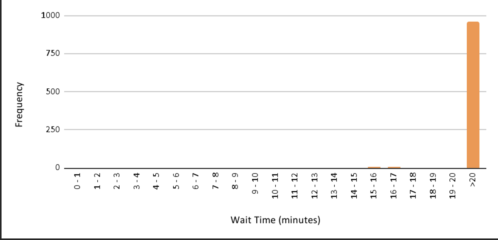

# Simulation Findings

This simulation modeled the Ulta Beauty store’s waiting line under three scenarios: base case, best case, and worst case. These scenarios were designed to reflect realistic variations in customer interarrival times and server efficiency, allowing us to estimate system performance under different operational conditions.

---
## 📈 Base Case Scenario

| Metric                                | Value         |
|---------------------------------------|---------------|
| Interarrival Time                     | 1.22 minutes  |
| Service Rate                          | 1.12 minutes  |
| Probability of Waiting                | 0.61          |
| Average Wait Time                     | 1.17 minutes  |
| Maximum Wait Time                     | 6.40 minutes  |
| Probability of Waiting > 1 Minute     | 0.39          |

- Base case values were calculated as the average interarrival rate and average service rate across all observations collected
- The wait times are reasonable, but the 61% chance of waiting highlights a possible area for improvement in the future

---

## 📈 Best Case Scenario

| Metric                                | Value         |
|---------------------------------------|---------------|
| Interarrival Time                     | 2.00 minutes  |
| Service Rate                          | 0.39 minutes  |
| Probability of Waiting                | 0.02          |
| Average Wait Time                     | 0.01 minutes  |
| Maximum Wait Time                     | 1.84 minutes  |
| Probability of Waiting > 1 Minute     | 0.003         |

- Best-case values assume the smallest interarrival rate and fastest service rate
- Wait times are nearly nonexistent, and this scenario is highly efficient

---

## ⚠️ Worst Case Scenario

| Metric                                | Value           |
|---------------------------------------|-----------------|
| Interarrival Time                     | 0.83 minutes    |
| Service Rate                          | 2.24 minutes    |
| Probability of Waiting                | 0.99            |
| Average Wait Time                     | 266.47 minutes  |
| Maximum Wait Time                     | 539.12 minutes  |
| Probability of Waiting > 20 Minutes   | 0.97            |

- Worst-case values assume the largest interarrival rate and the slowest service rate
- Nearly all customers wait, with unacceptable wait times
- This situation should be avoided at all costs!

---

