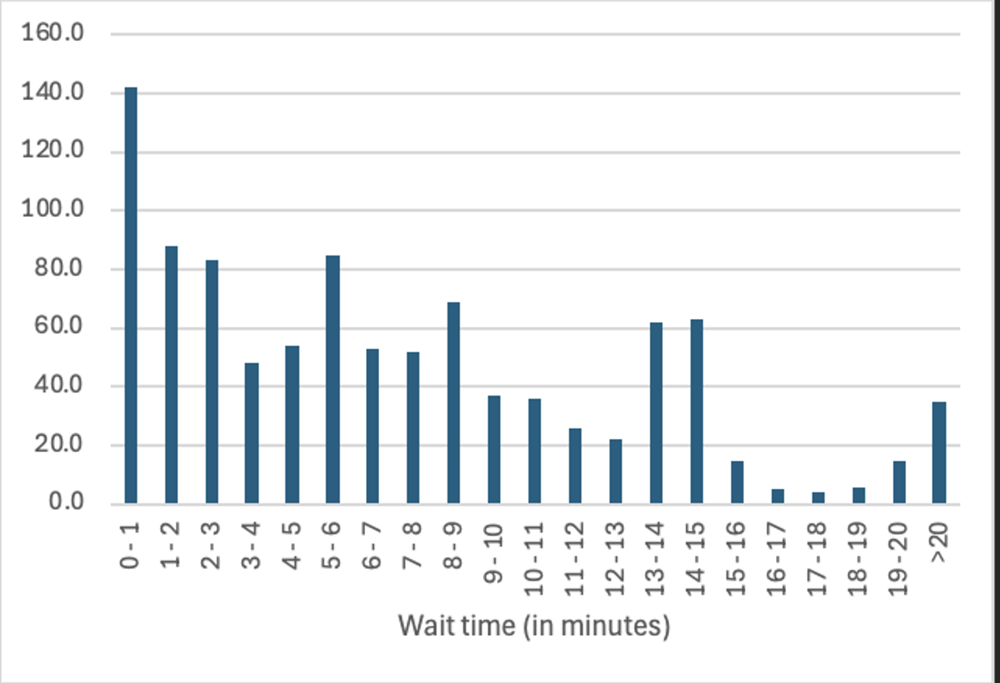

# 🔍 What-If Analysis Findings

Our what-if analysis modeled several scenarios to determine how staffing, server efficiency, and the quantity of servers influence wait times and service quality.

---

### 🧪 Base Case with 3 Servers

| Metric                   | Result                                     |
|--------------------------|--------------------------------------------|
| Avg Wait Time Change     | Decreased by ~30%                          |
| Max Wait Time Change     | Decreased by ~2 minutes                    |
| Key Insight              | More efficient than 2 servers, but incurs additional cost |

---

### 🧪 Base Case with 4 Servers

| Metric                   | Result                                     |
|--------------------------|--------------------------------------------|
| Avg Wait Time Change     | Marginal improvement                       |
| Max Wait Time Change     | Marginal improvement                       |
| Key Insight              | Minimal benefit, not cost-effective        |

 

---

### 🧪 1 Server During Peak Traffic

| Metric                   | Result                                     |
|--------------------------|--------------------------------------------|
| Avg Wait Time            | Very high                                  |
| Max Wait Time            | Extremely high                             |
| Key Insight              | Severely inefficient, avoid with proper staffing|

 

---

### 🧪 3 Servers During Peak Traffic

| Metric                   | Result                                     |
|--------------------------|--------------------------------------------|
| Avg Wait Time Change     | Cut in half                                |
| Max Wait Time Change     | Cut in half                                |
| Key Insight              | Improved efficiency and cost-effective  |

 

---

### 🧪 Base Case with Slowest Server

| Metric                   | Result                                     |
|--------------------------|--------------------------------------------|
| Avg Wait Time            | Increased to ~15 minutes                   |
| Max Wait Time            | Increased to ~30 minutes                   |
| Key Insight              | Server training and performance are critical |
| NOTE:                    | Slow service times are not always in the server's control (large transactions, customer disputes, etc). |

 

---

Results: **Strategic staffing increases during peak periods** increases efficiency while minimizing cost

